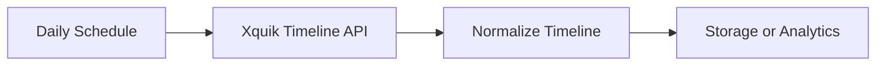

# Xquik Account Timeline Export

Export a public X account timeline into normalized n8n items through the Xquik API.

## Features

- Runs daily and fetches up to 100 recent posts by username.
- Excludes replies by default to keep the export focused.
- Normalizes engagement metrics and canonical post URLs.
- Emits a `no_results` item instead of returning an empty branch.
- Preserves `hasNextPage` and `nextCursor` for explicit follow-up pagination.
- Performs read-only requests and never publishes or changes account state.

## Flow



## Setup

1. Import `xquik-account-timeline.json` into n8n.
2. Create an HTTP Header Auth credential named `Xquik API Key`.
3. Set the credential header name to `x-api-key` and its value to your key.
4. Select that credential in the `Fetch Timeline with Xquik` node.
5. Set `XQUIK_USERNAME` in the n8n runtime environment.
6. Run the workflow once and inspect the normalized output before activation.

The workflow fails when `XQUIK_USERNAME` is missing instead of querying a
fallback account. Each run fetches 1 page. If `hasNextPage` is `true`, use
`nextCursor` in a follow-up workflow before treating the export as complete.

## Demo Output

```json
{
  "id": "1900000000000000000",
  "username": "example",
  "text": "A public post",
  "engagement": 18,
  "url": "https://x.com/example/status/1900000000000000000",
  "hasNextPage": false,
  "nextCursor": ""
}
```

The output can feed a database, spreadsheet, dashboard, or review workflow.

Xquik is an independent third-party service. Not affiliated with X Corp. "Twitter" and "X" are trademarks of X Corp.
